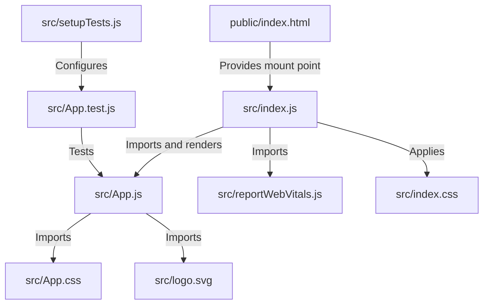

## Overview

The HNG React project follows the standard Create React App structure, organizing code into logical directories for easy navigation and maintenance.

## Directory Structure

```text
hng/
├── public/              # Static assets and HTML template
│   ├── favicon.ico      # Browser tab icon
│   ├── index.html       # HTML template
│   ├── logo192.png      # PWA icon (192x192)
│   ├── logo512.png      # PWA icon (512x512)
│   ├── manifest.json    # Progressive Web App manifest
│   └── robots.txt       # Search engine crawler instructions
├── src/                 # Application source code
│   ├── App.css          # Styles for App component
│   ├── App.js           # Main application component
│   ├── App.test.js      # Tests for App component
│   ├── index.css        # Global styles
│   ├── index.js         # Application entry point
│   ├── logo.svg         # React logo asset
│   ├── reportWebVitals.js  # Performance monitoring
│   └── setupTests.js    # Test configuration
├── .gitignore           # Git ignore rules
├── package.json         # Project dependencies and scripts
├── package-lock.json    # Locked dependency versions
└── README.md            # Project documentation
```

## Key Files Explained

### Entry Point

<Accordion title="src/index.js - Application Bootstrap">
The entry point that renders the React application into the DOM.

```javascript src/index.js
import React from 'react';
import ReactDOM from 'react-dom/client';
import './index.css';
import App from './App';
import reportWebVitals from './reportWebVitals';

const root = ReactDOM.createRoot(document.getElementById('root'));
root.render(
  <React.StrictMode>
    <App />
  </React.StrictMode>
);

reportWebVitals();
```

**Key responsibilities:**
- Creates the React root using `ReactDOM.createRoot` (React 18 feature)
- Wraps the app in `<React.StrictMode>` for development warnings
- Mounts the `<App />` component to the DOM element with id `root`
- Initializes performance monitoring with `reportWebVitals()`

<Note>
  The `root` element is defined in `public/index.html:31`
</Note>
</Accordion>

### Core Components

<Accordion title="src/App.js - Main Application Component">
The root component of your React application.

```javascript src/App.js
import logo from './logo.svg';
import './App.css';

function App() {
  return (
    <div className="App">
      <header className="App-header">
        
        <p>
          Edit <code>src/App.js</code> and save to reload.
        </p>
        <a
          className="App-link"
          href="https://reactjs.org"
          target="_blank"
          rel="noopener noreferrer"
        >
          Learn React
        </a>
      </header>
    </div>
  );
}

export default App;
```

**Purpose:**
- Serves as the main container for your application
- Imports and displays the React logo
- Provides the starting template for building features
- Exported as default for use in `index.js:4`
</Accordion>

### Styling

<AccordionGroup>
  <Accordion title="src/index.css - Global Styles">
    Global CSS applied to the entire application.

    ```css src/index.css
    body {
      margin: 0;
      font-family: -apple-system, BlinkMacSystemFont, 'Segoe UI', 'Roboto', 'Oxygen',
        'Ubuntu', 'Cantarell', 'Fira Sans', 'Droid Sans', 'Helvetica Neue',
        sans-serif;
      -webkit-font-smoothing: antialiased;
      -moz-osx-font-smoothing: grayscale;
    }

    code {
      font-family: source-code-pro, Menlo, Monaco, Consolas, 'Courier New',
        monospace;
    }
    ```

    **Purpose:**
    - Sets base styles for the entire app (no margin on body)
    - Defines system font stack for cross-platform consistency
    - Applies font smoothing for better text rendering
    - Styles inline code elements with monospace fonts
    - Imported in `src/index.js:3` before the app renders
  </Accordion>

  <Accordion title="src/App.css - Component Styles">
    Styles specific to the App component. See the [App Component](/components/app-component) documentation for detailed CSS class explanations including `.App`, `.App-header`, `.App-logo`, and `.App-link`.
  </Accordion>
</AccordionGroup>

### Performance Monitoring

<Accordion title="src/reportWebVitals.js - Web Vitals Tracking">
Measures and reports key performance metrics.

```javascript src/reportWebVitals.js
const reportWebVitals = onPerfEntry => {
  if (onPerfEntry && onPerfEntry instanceof Function) {
    import('web-vitals').then(({ getCLS, getFID, getFCP, getLCP, getTTFB }) => {
      getCLS(onPerfEntry);  // Cumulative Layout Shift
      getFID(onPerfEntry);  // First Input Delay
      getFCP(onPerfEntry);  // First Contentful Paint
      getLCP(onPerfEntry);  // Largest Contentful Paint
      getTTFB(onPerfEntry); // Time to First Byte
    });
  }
};

export default reportWebVitals;
```

**Metrics tracked:**
- **CLS** - Visual stability during page load
- **FID** - Responsiveness to user interactions
- **FCP** - Time until first content appears
- **LCP** - Time until main content loads
- **TTFB** - Server response time

<Tip>
  Pass `console.log` to see metrics in the console:
  ```javascript
  reportWebVitals(console.log);
  ```
</Tip>
</Accordion>

### Testing Setup

<AccordionGroup>
  <Accordion title="src/setupTests.js - Test Configuration">
    Configures the testing environment for all test files.

    ```javascript src/setupTests.js
    // jest-dom adds custom jest matchers for asserting on DOM nodes.
    // allows you to do things like:
    // expect(element).toHaveTextContent(/react/i)
    // learn more: https://github.com/testing-library/jest-dom
    import '@testing-library/jest-dom';
    ```

    This file runs before all tests and imports custom Jest matchers for DOM testing.
  </Accordion>

  <Accordion title="src/App.test.js - Example Test">
    Sample test demonstrating React Testing Library usage.

    ```javascript src/App.test.js
    import { render, screen } from '@testing-library/react';
    import App from './App';

    test('renders learn react link', () => {
      render(<App />);
      const linkElement = screen.getByText(/learn react/i);
      expect(linkElement).toBeInTheDocument();
    });
    ```

    **Test flow:**
    1. Renders the `<App />` component
    2. Queries for text matching "learn react"
    3. Asserts the element exists in the document
  </Accordion>
</AccordionGroup>

### Public Directory

<Accordion title="public/index.html - HTML Template">
The single HTML file that serves as the template for your React app.

```html public/index.html
<!DOCTYPE html>
<html lang="en">
  <head>
    <meta charset="utf-8" />
    <link rel="icon" href="%PUBLIC_URL%/favicon.ico" />
    <meta name="viewport" content="width=device-width, initial-scale=1" />
    <meta name="theme-color" content="#000000" />
    <meta name="description" content="Web site created using create-react-app" />
    <link rel="apple-touch-icon" href="%PUBLIC_URL%/logo192.png" />
    <link rel="manifest" href="%PUBLIC_URL%/manifest.json" />
    <title>React App</title>
  </head>
  <body>
    <noscript>You need to enable JavaScript to run this app.</noscript>
    <div id="root"></div>
  </body>
</html>
```

**Important notes:**
- The `<div id="root">` at line 31 is where React mounts the application
- `%PUBLIC_URL%` is replaced with the public folder path during build
- Only files in the `public/` folder can be referenced from HTML
</Accordion>

## File Relationships

Understanding how files connect helps navigate the codebase:



### Bootstrap Flow

<Steps>
  <Step title="Browser loads index.html">
    The browser requests `public/index.html:1-44`, which contains the root div and script references.
  </Step>
  
  <Step title="React initializes">
    `src/index.js:7` creates a React root attached to the `#root` element.
  </Step>
  
  <Step title="App renders">
    `src/index.js:9-11` renders the `<App />` component inside `<React.StrictMode>`.
  </Step>
  
  <Step title="Performance tracking starts">
    `src/index.js:17` calls `reportWebVitals()` to begin measuring metrics.
  </Step>
</Steps>

## Configuration Files

<AccordionGroup>
  <Accordion title="package.json - Project Metadata">
    Defines project dependencies, scripts, and configuration.

    **Key sections:**
    - `dependencies` (lines 5-13): Runtime packages
    - `scripts` (lines 14-18): Available npm commands
    - `eslintConfig` (lines 20-25): Linting rules
    - `browserslist` (lines 26-37): Target browser support
  </Accordion>

  <Accordion title=".gitignore - Version Control Rules">
    Specifies files and directories excluded from Git.

    **Ignored items:**
    - `/node_modules` - Installed dependencies
    - `/build` - Production build output
    - `/coverage` - Test coverage reports
    - `.env.*.local` - Local environment variables
    - Log files and OS-specific files

    See `.gitignore:1-24` for the complete list.
  </Accordion>
</AccordionGroup>

## Best Practices

<CardGroup cols={2}>
  <Card title="Component Organization" icon="folder">
    As your app grows, create subdirectories in `src/` like `components/`, `hooks/`, `utils/`, and `services/`.
  </Card>
  
  <Card title="Asset Management" icon="image">
    Place static assets in `public/` for direct reference, or import them in components for webpack optimization.
  </Card>
  
  <Card title="Styling Strategy" icon="paintbrush">
    Keep component-specific styles in separate CSS files (e.g., `App.css` for `App.js`).
  </Card>
  
  <Card title="Testing Colocation" icon="vial">
    Place test files next to the components they test using the `.test.js` suffix.
  </Card>
</CardGroup>

## Next Steps

<Card title="Available Scripts" icon="terminal" href="./available-scripts">
  Learn about the npm scripts available for development, testing, and building.
</Card>